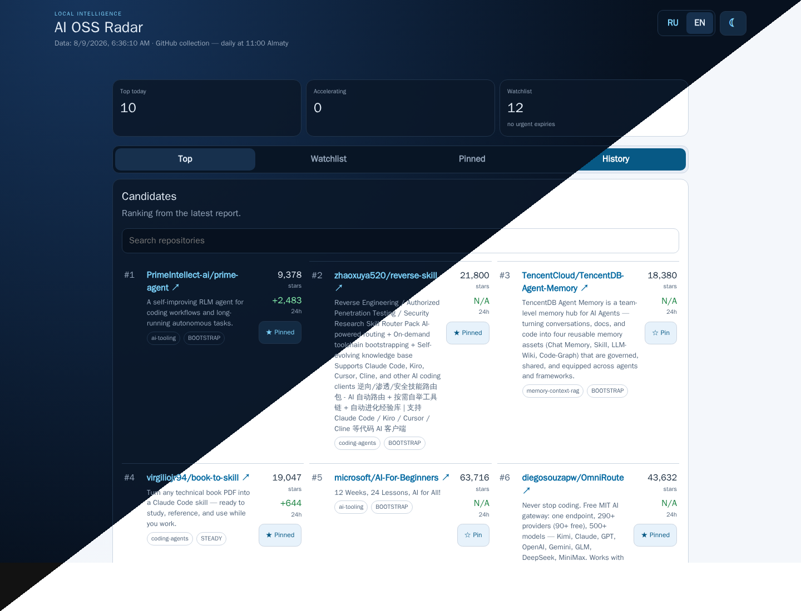

# AI OSS Radar

AI OSS Radar is a local-first product for discovering and tracking fast-moving AI open-source projects. It combines a scheduled **collector** with a mobile-first **dashboard**, while keeping production telemetry and access credentials outside source control.



*One live dashboard view, diagonally split between dark and light modes.*

## Product architecture

```text
GitHub discovery → Collector → SQLite + reports → Dashboard → browser
                                  ↑
                         manual pins only
```

- **Collector** (`collector/`) — one-shot protocol that discovers repositories, scores trends, maintains the automatic 14-day watchlist, writes SQLite snapshots and produces Markdown reports.
- **Dashboard** (`dashboard/`) — persistent FastAPI application for ranked candidates, project history, manual pins, RU/EN UI, and dark/light/system themes.
- **Deployment** (`deploy/`) — Compose definitions that retain a strict security boundary: dashboard receives `/data` read-only, while only `/control/pins.json` is writable.

## Security model

Runtime data is external to this repository. Never commit SQLite databases, reports, pin files, `.env` files, or access credentials.

The dashboard cannot write `radar.db`. Only the collector writes snapshots and reports. Manual project pins live in a separate control file and are collected on the next scheduled run.

## Development

Each component has its own uv project and lockfile:

```bash
cd collector && uv run ruff check . && uv run pytest
cd ../dashboard && uv run ruff check . && uv run pytest && node --check app/static/app.js
```

## Local deployment

Copy the environment template and choose an external data directory:

```bash
cp deploy/.env.example deploy/.env
# edit RADAR_DATA_DIR; do not place data inside this repository

docker compose --env-file deploy/.env -f deploy/docker-compose.dashboard.yml up -d --build
scripts/run-collector.sh
```

The default dashboard binding is `127.0.0.1:8096`; expose it through an SSH tunnel rather than a public reverse proxy.

## Product lifecycle

The collector is normally scheduled by an operator-controlled scheduler. The dashboard is always on and only rereads local data; it never triggers GitHub collection from the UI.

See [architecture](docs/architecture.md) and [operations](docs/operations.md) for deployment boundaries and cutover guidance.
